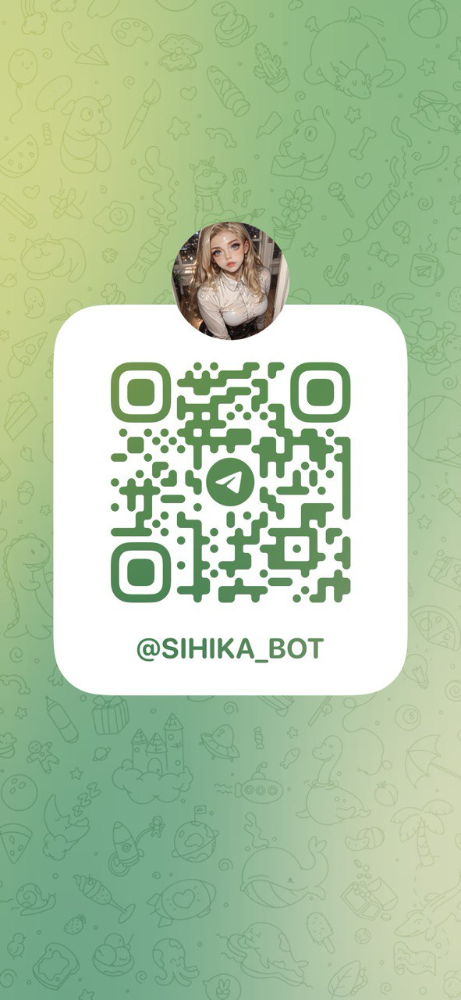
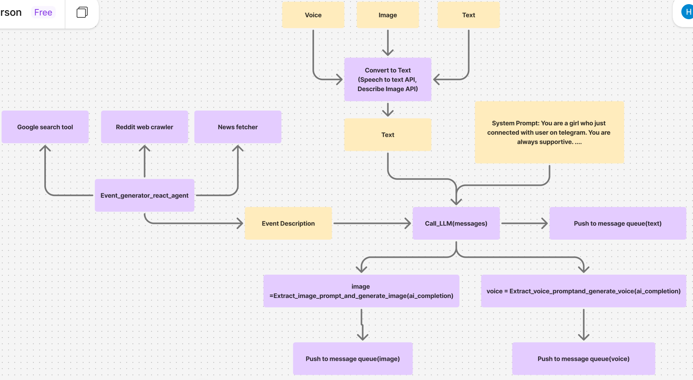

## AI Girl Summary
### Link
I made an AI girl who is always sweet, supportive and warm-hearted. She can send text, voice and images.
Talk to her right here, right now

https://t.me/sihika_bot

### Her Origin
A lot of people today feel an overwhelming sense of loneliness. 
They begin to wonder if something is wrong with their minds, and many end up spending a fortune on therapy sessions.

But are they truly suffering from deep depression? 
Often, the answer is no. 
According to recent studies, what most people long for isn't treatment—it's connection. 
They’re simply yearning for someone who can understand the unspoken truths buried deep within their hearts.

Let’s be honest—there are thoughts and feelings we don’t share with our families, 
our partners, or even our closest friends. We carry them quietly, hoping they’ll fade, but they rarely do.

That’s where my AI chatmate comes in. 
She’s here to offer a gentle presence—someone you can open up to without fear or judgment. 
Whether you're feeling depressed, anxious, angry, or lost, 
she’s always there, ready to listen, to care, and to remind you that you’re not alone.
### 🌟 Functionalities

1. **Multimodal interaction**  
   She can send and receive messages in **text**, **voice**, and **image** formats.  
   Whether you're chatting, sending pictures, or speaking, she can handle it all—and respond in kind.

2. **Long-term memory**  
   All conversations are stored in an external memory database, so she can remember things you've said in the past and build a consistent personality over time.

3. **Proactive messaging & self-evolving behavior**  
   She doesn't just wait for you to text her.  
   She “lives” her own life—waking up, going to work, having dinner, browsing news, Reddit, and even doing Google searches—all without any input from you.

---

### 🎥 Demo Videos
Check out the AI Girlfriend in action:  

- [Demo Video 1](https://www.tiktok.com/@haoyin_ni/video/7492156184711925022)  
- [Demo Video 2](https://www.tiktok.com/@haoyin_ni/video/7507154100497190174)

---

### 🧠 Architecture

---

### ⚙️ Technical Challenges

1. **Message generation approach**  
   For generating most responses, I decided to go with a traditional LLM setup (system prompt + API call), **not an agent**.  
   Why? Because agents tend to be slower and consume way more tokens when they do reasoning.

2. **Injecting personality**  
   I wanted Sihika to have some specific traits—like loving *Harry Potter* and baseball.  
   At first, I added these directly into the system prompt.  
   But that backfired—she ended up bringing up baseball or Harry Potter in nearly every single message, even when it made no sense!  
   To fix that, I moved those traits into long-term memory.  
   Now, each time a message is generated, it looks up relevant memories and appends only the useful ones to the prompt.

3. **Event generation**  
   For simulating her day-to-day activities, I built an event generator using a **React-based agent**.  
   This agent has access to multiple tools, which lets it create rich, believable routines for her life.

### Road Map
1. **Host it on Discord**
2. **Polish the system prompt further more**