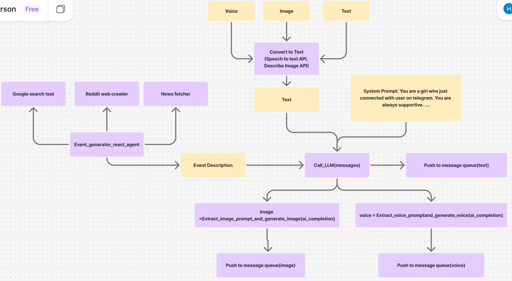

## How AI Girlfriend Works

### 🌟 Functionalities

1. **Multimodal interaction**  
   She can send and receive messages in **text**, **voice**, and **image** formats.  
   Whether you're chatting, sending pictures, or speaking, she can handle it all—and respond in kind.

2. **Long-term memory**  
   All conversations are stored in an external memory database, so she can remember things you've said in the past and build a consistent personality over time.

3. **Proactive messaging & self-evolving behavior**  
   She doesn't just wait for you to text her.  
   She “lives” her own life—waking up, going to work, having dinner, browsing news, Reddit, and even doing Google searches—all without any input from you.

---

### 🎥 Demo Videos

Check out the AI Girlfriend in action:  
<video width="640" height="360" controls>
  <source src="./img/animation.mp4" type="video/mp4">
  Your browser does not support the video tag.
</video>
- [Demo 1](https://www.tiktok.com/@haoyin_ni/video/7492156184711925022)  
- [Demo 2](https://www.tiktok.com/@haoyin_ni/video/7507154100497190174)

---

### 🧠 Architecture

---

### ⚙️ Technical Challenges

1. **Message generation approach**  
   For generating most responses, I decided to go with a traditional LLM setup (system prompt + API call), **not an agent**.  
   Why? Because agents tend to be slower and consume way more tokens when they do reasoning.

2. **Injecting personality**  
   I wanted Sihika to have some specific traits—like loving *Harry Potter* and baseball.  
   At first, I added these directly into the system prompt.  
   But that backfired—she ended up bringing up baseball or Harry Potter in nearly every single message, even when it made no sense!  
   To fix that, I moved those traits into long-term memory.  
   Now, each time a message is generated, it looks up relevant memories and appends only the useful ones to the prompt.

3. **Event generation**  
   For simulating her day-to-day activities, I built an event generator using a **React-based agent**.  
   This agent has access to multiple tools, which lets it create rich, believable routines for her life.
